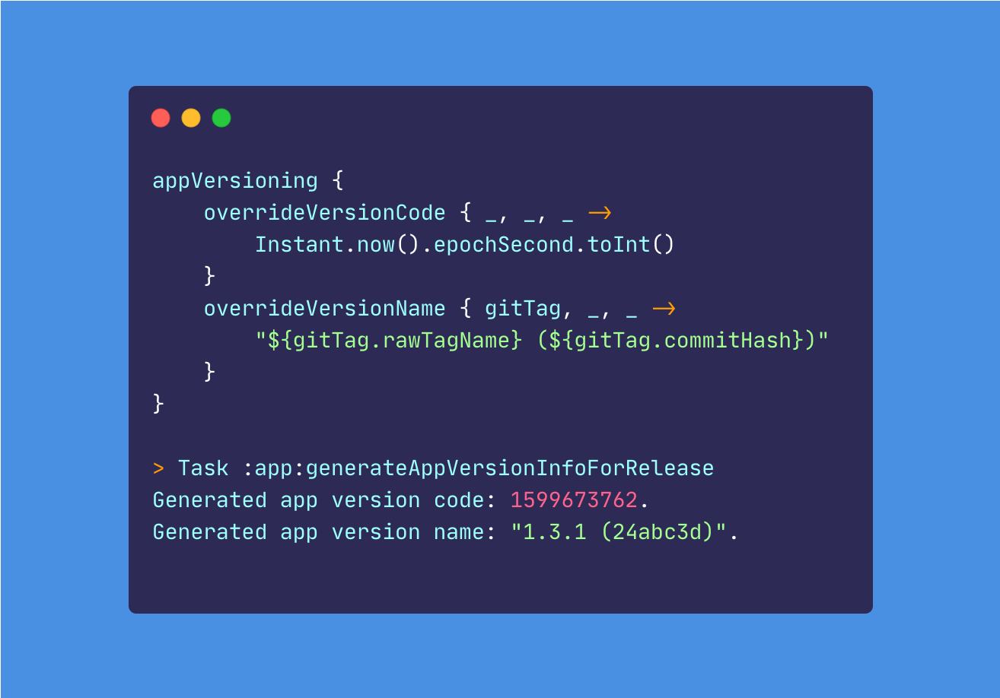

# App Versioning


[](https://search.maven.org/search?q=g:io.github.reactivecircus.appversioning)
[](https://opensource.org/licenses/Apache-2.0)

A Gradle Plugin for lazily generating Android app's `versionCode` & `versionName` from Git tags.



Android Gradle Plugin 4.0 introduced some [new APIs](https://medium.com/androiddevelopers/new-apis-in-the-android-gradle-plugin-f5325742e614) to support **lazily** computing and setting the `versionCode` and `versionName` for an APK or App Bundle. This plugin builds on top of these APIs to support the common app versioning use cases based on Git.

**Minimum version of Android Gradle Plugin required is `4.0.0`.**

## Installation

The **Android App Versioning Gradle Plugin** is available from both [Maven Central](https://search.maven.org/artifact/io.github.reactivecircus.appversioning/app-versioning-gradle-plugin) and [Gradle Plugin Portal](https://plugins.gradle.org/plugin/io.github.reactivecircus.app-versioning). Make sure your top-level `build.gradle` has **either** `mavenCentral()` or `gradlePluginPortal()` defined in the `buildscript` block:

```groovy
buildscript {
    repositories {
        // add either one of the following repositories
        mavenCentral()
        gradlePluginPortal()
    }
}
```

The plugin can now be applied to your **Android Application** module (Gradle subproject).

If you use Kotlin DSL (`build.gradle.kts`):

```kotlin
plugins {
    id("com.android.application")
    id("io.github.reactivecircus.app-versioning") version "x.y.z"
}
```

If you use Groovy DSL (`build.gradle`):

```groovy
plugins {
    id 'com.android.application'
    id 'io.github.reactivecircus.app-versioning' version "x.y.z"
}
```

The `version` can be omitted by adding a classpath dependency in the `buildscript` block within the top-level `build.gradle`:

```groovy
buildscript {
    repositories {
        mavenCentral()
        google()
        gradlePluginPortal()
    }

    dependencies {
        classpath "io.github.reactivecircus.appversioning:app-versioning-gradle-plugin:x.y.z"
    }
}
```

## Usage

The plugin offers 2 Gradle tasks for each build variant:

- `generateAppVersionInfoFor<BuildVariant>` - generates the `versionCode` and `versionName` for the `BuildVariant`. This task is automatically triggered when assembling the APK or AAB e.g. by running `assemble<BuildVariant>` or `bundle<BuildVariant>`, and the generated `versionCode` and `versionName` will be injected into the final merged `AndroidManifest`.
- `printAppVersionInfoFor<BuildVariant>` - prints the latest `versionCode` and `versionName` generated by the plugin to the console if available.

### Default behavior

Without any configurations, by default the plugin will fetch the latest Git tag in the repository, attempt to parse it into a **SemVer** string, and compute the `versionCode` following [positional notation](https://en.wikipedia.org/wiki/Positional_notation):

```
versionCode = MAJOR * 10000 + MINOR * 100 + PATCH
```

As an example, for a tag `1.3.1` the generated `versionCode` is `1 * 10000 + 3 * 100 + 1 = 10301`.

The default `versionName` generated will just be the name of the latest Git tag.

```
> Task :app:generateAppVersionInfoForRelease
Generated app version code: 10301.
Generated app version name: "1.3.1".
```

If the default behavior described above works for you, you are all set to go.

### Custom rules

The plugin lets you define how you want to compute the `versionCode` and `versionName` by implementing lambdas which are evaluated lazily during execution:

```kotlin
appVersioning {
    overrideVersionCode { gitTag, providers ->
        // TODO generate an Int from the given gitTag and/or providers
    }

    overrideVersionName { gitTag, providers ->
        // TODO generate a String from the given gitTag and/or providers
    }
}
```

`GitTag` is a type-safe representation of a tag encapsulating the `rawTagName`, `commitsSinceLatestTag` and `commitHash`, provided by the plugin.

`providers` is a `ProviderFactory` instance which is a Gradle API that can be useful for [reading environment variables and system properties lazily](https://docs.gradle.org/current/javadoc/org/gradle/api/provider/ProviderFactory.html).

#### SemVer-based version code

The plugin by default reserves 2 digits for each of the **MAJOR**, **MINOR** and **PATCH** components in a SemVer tag.

To allocate 3 digits per component instead (i.e. each version component can go up to 999):

```kotlin
import io.github.reactivecircus.appversioning.toSemVer
appVersioning {
    overrideVersionCode { gitTag, providers ->
        val semVer = gitTag.toSemVer()
        semVer.major * 1000000 + semVer.minor * 1000 + semVer.patch
    }
}
```

`toSemVer()` is an extension function (or `SemVer.fromGitTag(gitTag)` if you use Groovy) provided by the plugin to help create a type-safe `SemVer` object from the `GitTag` by parsing its `rawTagName` field.

If a Git tag is not fully [SemVer compliant](https://semver.org/#semantic-versioning-specification-semver) (e.g. `1.2`), calling `gitTag.toSemVer()` will throw an exception. In that case we'll need to find another way to compute the `versionCode`.

#### Using timestamp for version code

Since the key characteristic for `versionCode` is that it must **monotonically increase** with each app release, a common approach is to use the Epoch / Unix timestamp for `versionCode`:

```kotlin
import java.time.Instant
appVersioning {
    overrideVersionCode { _, _ ->
        Instant.now().epochSecond.toInt()
    }
}
```

This will generate a monotonically increasing version code every time the `generateAppVersionInfoForRelease` task is run:

```
Generated app version code: 1599750437.
```

#### Using environment variable

We can also add a `BUILD_NUMBER` environment variable provided by CI to the `versionCode` or `versionName`. To do this, use the `providers` lambda parameter to create a provider that's only queried during execution:

```kotlin
import io.github.reactivecircus.appversioning.toSemVer
appVersioning {
    overrideVersionCode { gitTag, providers ->
        val buildNumber = providers
            .environmentVariable("BUILD_NUMBER")
            .getOrElse("0").toInt()
        val semVer = gitTag.toSemVer()
        semVer.major * 10000 + semVer.minor * 100 + semVer.patch + buildNumber
    }
}
```

`versionName` can be customized with the same approach:

```kotlin
import io.github.reactivecircus.appversioning.toSemVer
appVersioning {
    overrideVersionName { gitTag, providers ->
        // a custom versionName combining the tag name, commitHash and an environment variable
        val buildNumber = providers
            .environmentVariable("BUILD_NUMBER")
            .getOrElse("0").toInt()
        "${gitTag.rawTagName} - #$buildNumber (${gitTag.commitHash})"
    }
}
```

## More configurations

### Disabling the plugin

To disable the plugin such that the `versionCode` and `versionName` defined in the `defaultConfig` block are used instead (if specified):

```kotlin
appVersioning {
    /**
     * Whether to enable the plugin.
     *
     * Default is `true`.
     */
    enabled.set(false)
}
```

### Release build only

To generate `versionCode` and `versionName` **only** for the `Release` build type:

```kotlin
appVersioning {
    /**
     * Whether to only generate version name and version code for `release` builds.
     *
     * Default is `false`.
     */
    releaseBuildOnly.set(true)
}
```

With `releaseBuildOnly` set to `true`, for a project with the default `debug` and `release` build types and no product flavors, the following tasks are available (note the absense of tasks with `Debug` suffix):

```
/gradlew tasks --group=versioning

Versioning tasks
----------------
generateAppVersionInfoForRelease - Generates app's versionCode and versionName based on git tags for the release variant.
printAppVersionInfoForRelease - Prints the versionCode and versionName generated by Android App Versioning plugin (if available) to the console for the release variant.
```

### Fetching tags if none exists locally

Sometimes a local checkout may not contain the Git tags (e.g. when cloning was done with `--no-tags`). To fetch git tags from remote when no tags can be found locally:

```kotlin
appVersioning {
    /**
     * Whether to fetch git tags from remote when no git tag can be found locally.
     *
     * Default is `false`.
     */
    fetchTagsWhenNoneExistsLocally.set(true)
}
```

## App versioning on CI

For performance reason many CI providers only fetch a single commit by default when checking out the repository. For **app-versioning** to work we need to make sure Git tags are also fetched. Here's an example for doing this with [GutHub Actions](https://github.com/actions/checkout):

```
- uses: actions/checkout@v2
  with:
    fetch-depth: 0
```

### Retrieving the generated version code and version name

Both the `versionCode` and `versionName` generated by **app-versioning** are in the build output directory:

```
app/build/outputs/app_versioning/<buildVariant>/version_code.txt
app/build/outputs/app_versioning/<buildVariant>/version_name.txt
```

We can `cat` the output of these files into variables:

```
VERSION_CODE=$(cat app/build/outputs/app_versioning/<buildVariant>/version_code.txt)
VERSION_NAME=$(cat app/build/outputs/app_versioning/<buildVariant>/version_name.txt)
```

Note that if you need to query these files in a different VM than where the APK (and its version info) was originally generated, you need to make sure these files are "carried over" from the original VM. Otherwise you'll need to run the `generateAppVersionInfoFor<BuildVariant>` task again to generate these files, but the generated version info might not be the same as what's actually used for the APK (e.g. if you use the Epoch timestamp for `versionCode`).

Here's an example with GitHub Actions that does the following:

- in the [Assemble job](https://github.com/ReactiveCircus/streamlined/blob/f0b605627ffaa2a51b37cdec7c2dd846ad3a7dbf/.github/workflows/ci.yml#L33-L72), build the App Bundle and archive / upload the build outputs directory which include the AAB and its R8 mapping file, along with the `version_code.txt` and `version_name.txt` files generated by **app-versioning**.
- later in the [Publish to Play Store job](https://github.com/ReactiveCircus/streamlined/blob/f0b605627ffaa2a51b37cdec7c2dd846ad3a7dbf/.github/workflows/ci.yml#L202-L247), download the previously archived build outputs directory, `cat` the content of `version_code.txt` and `version_name.txt` into variables, upload the R8 mapping file to Bugsnag API with curl and passing the retrieved `$VERSION_CODE` and `$VERSION_NAME` as parameters, and finally upload the AAB to Play Store (without building the AAB or generating the app version info again).

## License

```
Copyright 2020 Yang Chen

Licensed under the Apache License, Version 2.0 (the "License");
you may not use this file except in compliance with the License.
You may obtain a copy of the License at

   http://www.apache.org/licenses/LICENSE-2.0

Unless required by applicable law or agreed to in writing, software
distributed under the License is distributed on an "AS IS" BASIS,
WITHOUT WARRANTIES OR CONDITIONS OF ANY KIND, either express or implied.
See the License for the specific language governing permissions and
limitations under the License.
```
